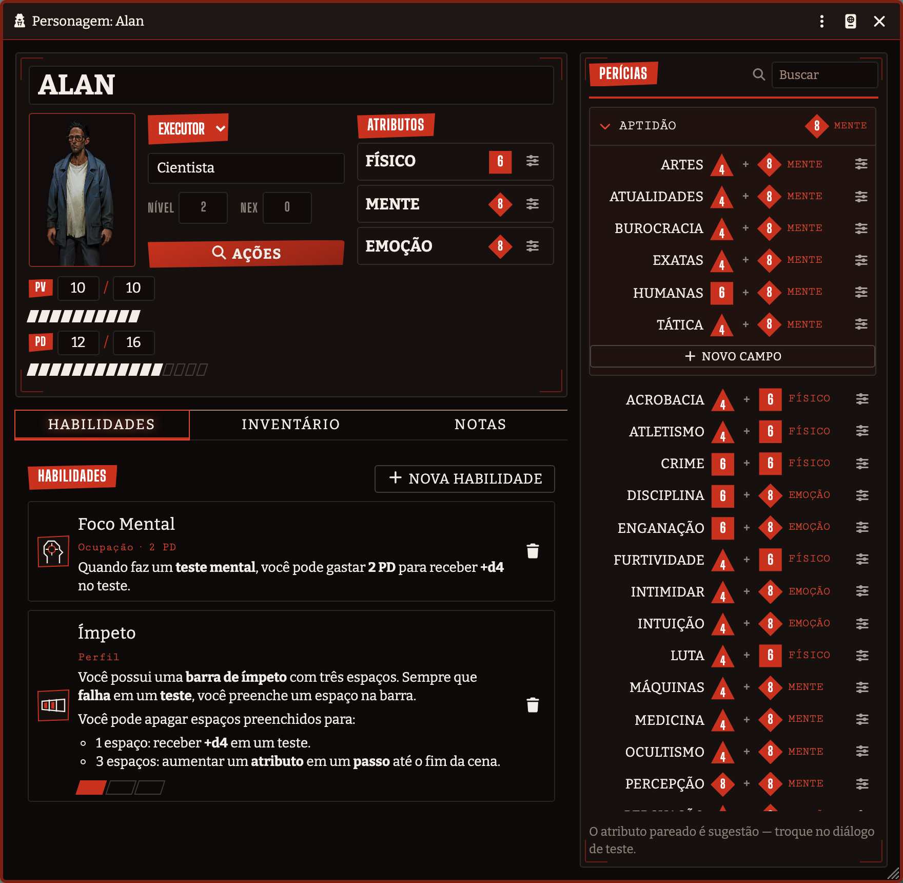
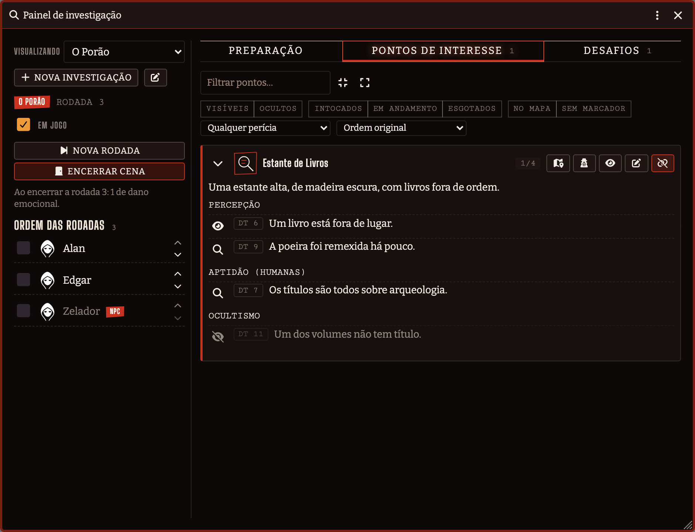
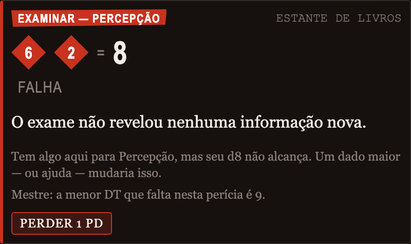
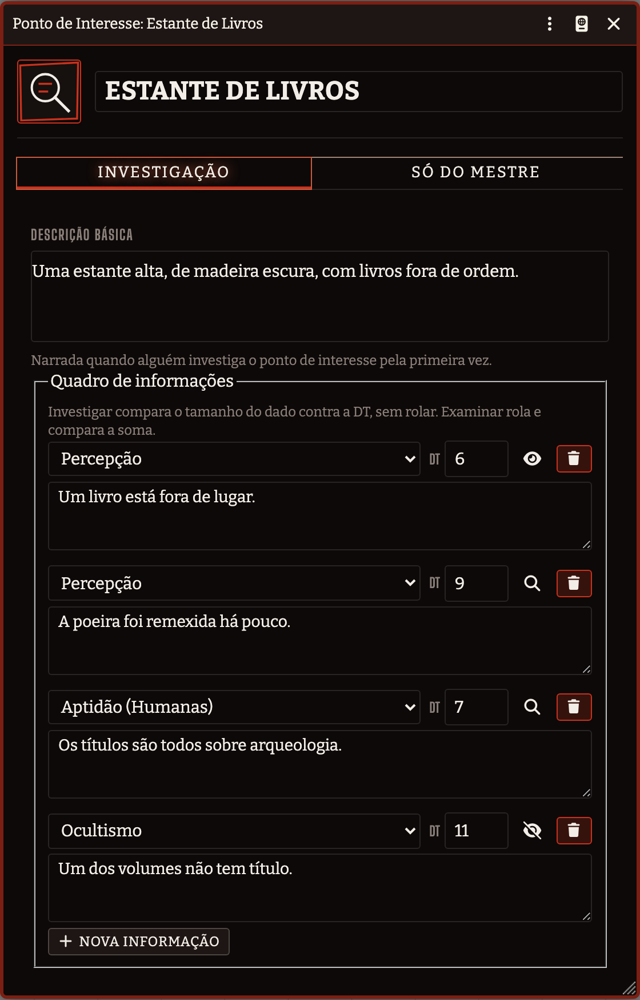
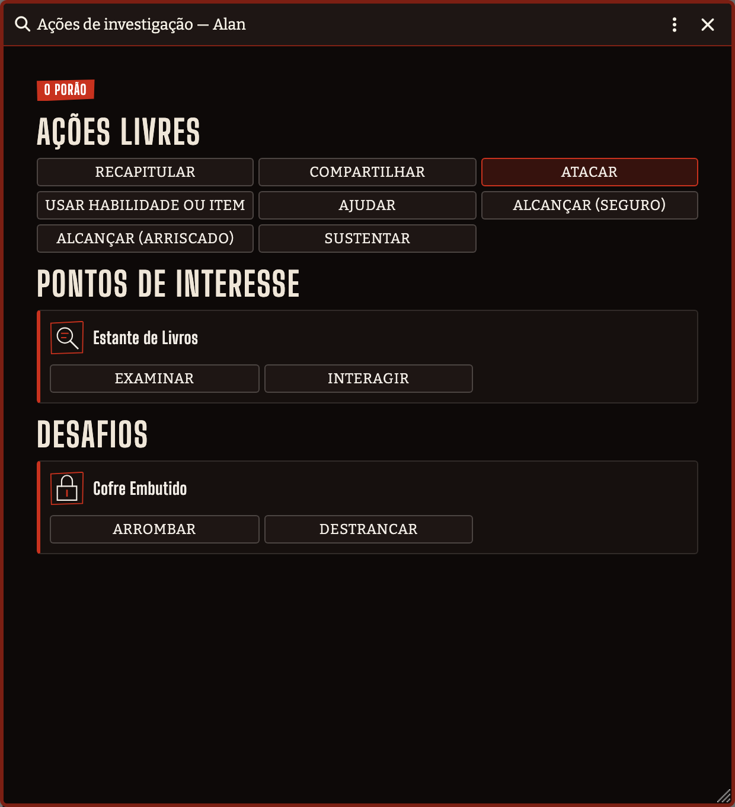
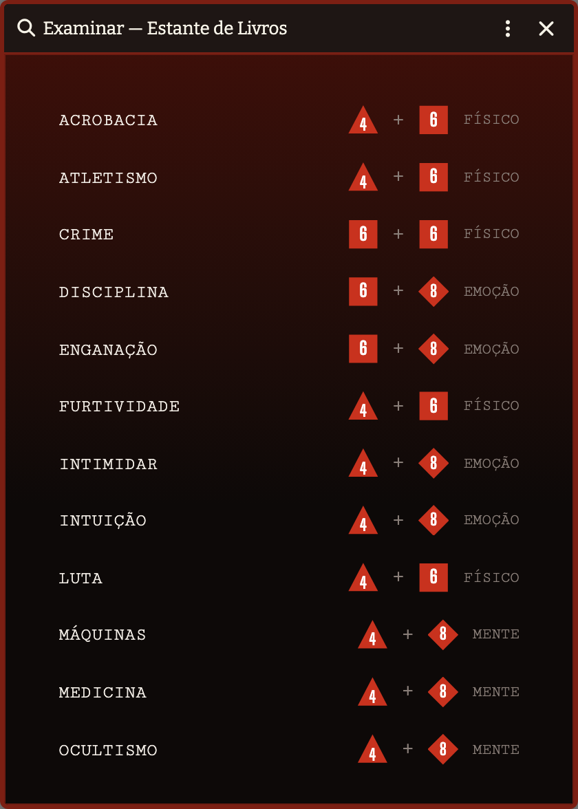
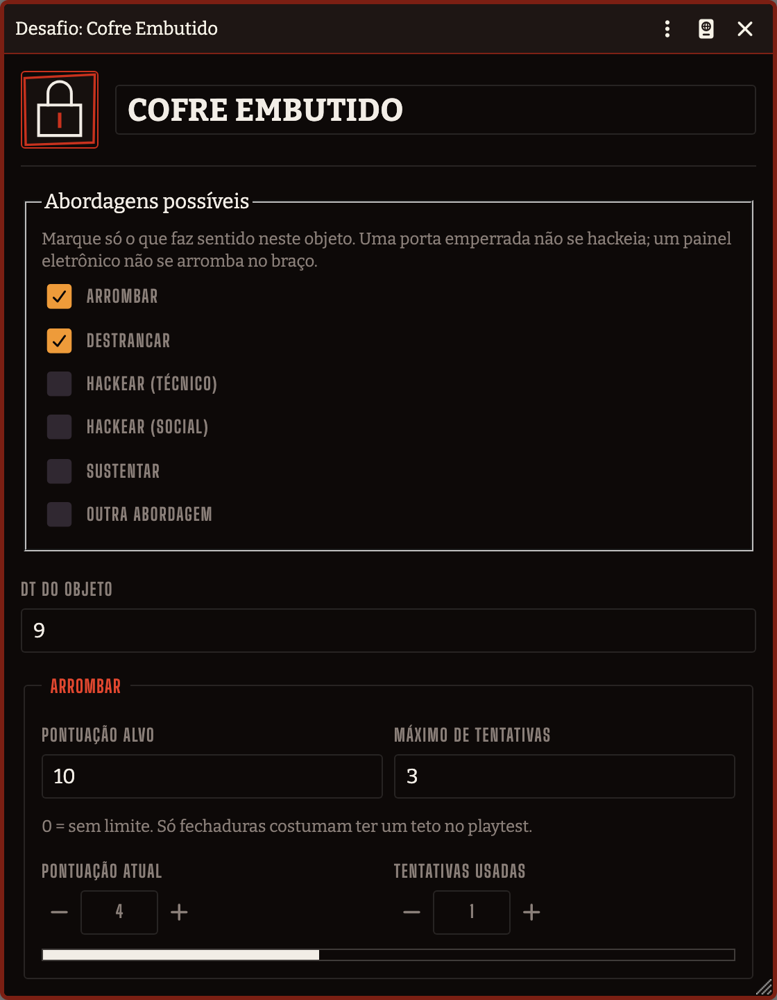
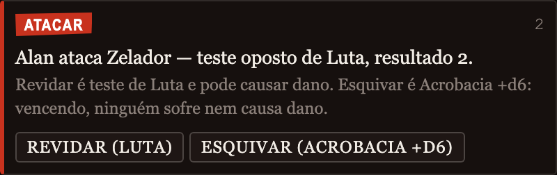

# Ordem Paranormal 2 — Playtest (Não-Oficial)

Sistema para **Foundry VTT** do playtest alpha de *Ordem Paranormal RPG 2*.

> Projeto não-oficial, feito por fã. Sem afiliação, patrocínio ou endosso dos detentores
> de direitos de Ordem Paranormal RPG. Não distribui textos, artes nem conteúdo protegido
> do jogo — só a camada mecânica e a interface.




## O que ele faz

**Dados em escada, não modificadores.** Atributos e perícias são *tamanho de dado*
(d4→d12). Tudo que os modifica sobe ou desce um degrau — nada de `+2`.

**A ficha é a do livro.** Cada perícia mostra o par que será rolado, com os ícones
geométricos que o playtest usa: triângulo d4, quadrado d6, losango d8, pipa d10,
octógono d12. Clique na perícia para rolar; Shift abre o diálogo. Clique no dado para
trocá-lo, ou role a roda do mouse sobre ele. PV, PD e a barra de Ímpeto são trilhas
clicáveis.

**O motor entende as regras sutis:**

- **RA e RB** — o maior e o menor *valor* rolado, não o dado maior. Sempre no card,
  porque arrombar, alcançar e combate leem esses números direto.
- **Crítico** — dois ou mais dados iguais com valor ≥ 6. Ignora a DT.
- **Falha crítica** — todos os dados em 1. Ignora a DT, e oferece a tabela de 1d8 ao
  mestre. Nada é aplicado sem clique dele.
- **Até 4 dados rolados, 3 somados** — com diálogo de escolha, porque a soma máxima
  nem sempre é a melhor jogada.
- **Trocar o atributo pareado** antes de rolar: o atributo-base é sugestão, não trava.
- **Reduções temporárias** de atributo, com botão de *Encerrar cena* que as zera.

**Aptidão é coleção aberta.** Os seis campos padrão vêm prontos, e você adiciona
quantos quiser.

## Investigação

O coração do playtest (spec §6). O mestre monta a cena num painel; os jogadores agem
pela própria ficha.



**Não existe uma ação "Investigar".** Investigar um ponto é **Examinar** ou
**Interagir** — as duas sub-ações em que a ação se resolve. Examinar faz os dois passos
da regra com a mesma perícia:

1. **sem rolar**, entrega tudo com DT ≤ ao tamanho do seu dado;
2. **rolando**, tenta o que ficou acima disso.

Só custa 1 PD quando os dois vêm vazios — e aí o card diz por quê (a perícia não serve
ali, o dado é pequeno, ou já se descobriu tudo).



Cada linha do quadro de informações tem **três estados**, num clique só do mestre:

| Ícone | Estado | O que significa |
|---|---|---|
| 👁️‍🗨️ | Rascunho | O jogador não vê, e Examinar nunca encontra |
| 🔍 | Descobrível | Só quem examinar com a perícia e alcançar a DT |
| 👁️ | Aberta | Todo jogador vê, sem gastar ação |

O painel mostra ao mestre quem descobriu cada linha e um botão para **desfazer** a
descoberta, sem precisar encerrar a cena.



**Sobrecarga mental** (spec §7.6): ao fim de cada rodada, a tabela da cena cobra PD de
todo mundo. A progressão de referência do playtest vem pronta e é editável por
investigação; quando o dano é rolado, cada jogador rola o seu.

## Ações

Tudo que um personagem faz sai da ficha dele, pelo botão **Ações** — nunca do painel do
mestre. Um jogador com dois personagens sempre sabe qual dos dois está agindo.



Ações livres (Recapitular, Compartilhar, Ajudar, Usar habilidade ou item, Alcançar,
Sustentar, Atacar), os pontos de interesse com Examinar/Interagir e as ferramentas que
aquele personagem carrega, e os desafios com as abordagens que o mestre habilitou.

Quando uma ação precisa de perícia, a escolha usa a mesma lista da ficha:



## Desafios

Um obstáculo entre o grupo e a pista. O mestre liga só as abordagens que fazem sentido
naquele objeto — uma porta emperrada não se hackeia, um painel eletrônico não se arromba
no braço.



- **Arrombar** (§7.2) — 1 PV por tentativa, acumula RA até a pontuação alvo.
- **Destrancar** (§7.1) — minigame de Mastermind, com histórico de palpites.
- **Hackear** (§7.3) — técnico (com cronômetro de 10s) e social (banco de perguntas do
  mestre), cada um com o próprio gate de rodada.
- **Genérico** — qualquer outra situação: o mestre diz a perícia e o rótulo.

## Combate e ferimentos

Versão simplificada e explicitamente temporária do playtest (§8), isolada para ser
trocada inteira quando sair a definitiva.



Teste oposto de Luta; quem vence causa RA com arma ou RB desarmado. O defensor escolhe
entre revidar e **esquivar** — Acrobacia com um d6 somado, a única exceção aditiva do
playtest: vencendo, ninguém sofre nem causa dano.

Zerar PV pede teste de **Vigor**; zerar PD pede **Disciplina**. A DT escala 7 → 10 → 13
→ 16 por teste já feito, e a consequência da falha no trauma é configurável, porque o
próprio texto avisa que vai mudar.

## Compêndios do Ato I

O sistema traz os dados dos cinco pré-gerados do Ato I e das habilidades deles, prontos
para importar. **As imagens não vêm junto** — são material da editora, liberado de graça
para o playtest, mas não nosso para redistribuir. Quem já tem a pasta pública instala
com um comando:

```bash
# a pasta liberada vai em docs/Arquivos para o público - Ato I/
npm run ato-i
```

Isso copia handouts, tokens, mapas, músicas e históricos para `op2-ato-i/` dentro do seu
User Data, que é onde os compêndios os procuram. Depois é só importar:

| Compêndio | Conteúdo |
|---|---|
| Ato I — Pré-gerados | Alan, Edgar, Eloísa, Kênia e Victor, com habilidades e tokens |
| Ato I — Handouts | os 18 handouts e os 5 históricos de personagem |
| Habilidades | Foco Mental, Ímpeto, Avaliação, Mentoria, Prontidão e as demais |
| Ocupações | Cientista, Operário, Artista, Profissional de escritório e Professor |
| Ferramentas da Ordo Realitas | as 10 do §9, com as cargas da regra |

Ocupação é texto livre na ficha e concede uma habilidade (spec §2.1). O Item de
ocupação guarda as duas coisas juntas: **arraste a ocupação para a ficha** e ela
preenche o campo e traz a habilidade dela, já marcada como de ocupação.

## Em português

O sistema é escrito em pt-BR primeiro, e um jogador que ainda não escolheu idioma entra
em português automaticamente — mesmo que o servidor esteja configurado em inglês. Quem já
escolheu um idioma mantém o seu, e o mestre desliga esse comportamento em
**Configurações → Padronizar o idioma em português**.

Isso traduz o sistema. A interface do **próprio Foundry** continua em inglês até você
instalar a tradução da comunidade — o manifesto já a recomenda:

```
https://github.com/mclemente/fvtt-ptbr-core-translation/releases/latest/download/module.json
```

## Compatível com v13 e v14

A maior quebra entre as versões é o formato dos Active Effects. Este sistema não usa
Active Effects: a escada de dados não é representável pelo modo aditivo do core, então
os passos são resolvidos em `prepareDerivedData()`. Isso deixa o mesmo código rodando
nas duas versões sem camada de adaptação.

## Instalação

Cole o manifesto no instalador de sistemas do Foundry:

```
https://github.com/SergioSJS/ordem-paranormal-2e-fvtt/releases/latest/download/system.json
```

## Desenvolvimento

```bash
npm install
npm run setup        # symlink para a pasta de sistemas do Foundry
npm run watch:css    # sass em watch
npm run check        # lint + testes + build do CSS
npm run pack:build   # compila os compêndios de packs/sources/
npm run e2e          # roda o sistema num Foundry de verdade
```

`npm run check` roda o lint, os testes offline (`node --test`, sem runner externo) e o
build do CSS. `npm run e2e` sobe o sistema num Foundry descartável e confere o que os
testes offline não alcançam — sanitização dos cards de chat, contexto real das fichas,
hooks depreciados, CSS aplicado, texto cortado. O passo a passo está em
[scripts/e2e/README.md](scripts/e2e/README.md).

Os prints deste README são gerados por `node scripts/e2e/capturar.mjs`, contra o mesmo
Foundry descartável — nenhuma tela aqui é mockup.

Detalhes do loop local, teste em duas versões do Foundry e convenções: [CLAUDE.md](CLAUDE.md).

## Estado

Em desenvolvimento, versão 0.0.1.

| Fase | O que entrou | Situação |
|---|---|---|
| 1 | Ficha, motor de dados, escada, crítico/falha crítica | pronta |
| 2 | Investigação: POIs, Examinar/Interagir, Recapitular, Compartilhar, rodadas, sobrecarga | pronta |
| 3 | Desafios (Arrombar, Destrancar, Hackear, genérico), Alcançar, Sustentar, ferramentas da Ordo Realitas | pronta |
| 4 | Testes opostos, Ajuda, usar habilidades e itens, combate simplificado, ferimentos e traumas | pronta |

O playtest é explicitamente parcial: NEX, progressão por nível e traumas permanentes
ainda não foram publicados. Onde o texto é ambíguo ou se contradiz, o sistema expõe um
**setting** com o default recomendado — a lista está em [docs/LACUNAS.md](docs/LACUNAS.md).

O roadmap completo está em [docs/ROADMAP.md](docs/ROADMAP.md).

## Licença

Código sob [GPL-3.0](LICENSE) — Copyright (C) 2026 Sérgio Sousa. Fontes sob OFL 1.1 — veja
[assets/fonts/LICENSES.md](assets/fonts/LICENSES.md).
