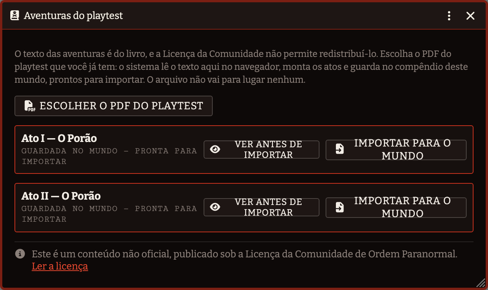
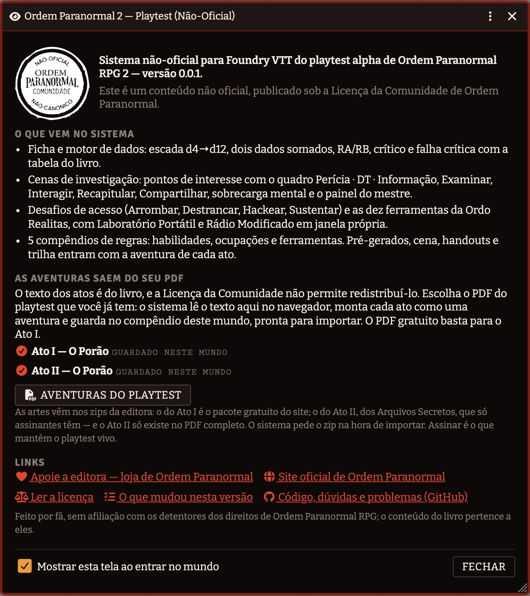

# Ordem Paranormal 2 — Playtest (Não-Oficial)


> Este é um conteúdo não oficial, publicado sob a
> [Licença da Comunidade de Ordem Paranormal](https://ordemparanormal.com.br/licenca).
> Feito por fã, sem afiliação com os detentores dos direitos; o conteúdo do livro
> pertence a eles — e por isso nem o texto nem as artes do livro vêm no pacote.

Sistema para **Foundry VTT** do playtest alpha de *Ordem Paranormal RPG 2*.

> Projeto não-oficial, feito por fã. Sem afiliação, patrocínio ou endosso dos detentores
> de direitos de Ordem Paranormal RPG. Não distribui textos, artes nem conteúdo protegido
> do jogo — só a camada mecânica e a interface.


## O que ele faz

**Dados em escada, não modificadores.** Atributos e perícias são *tamanho de dado*
(d4→d12). Tudo que os modifica sobe ou desce um degrau — nada de `+2`.

**A ficha é a do livro.** Cada perícia mostra o par que será rolado, com os ícones
geométricos que o playtest usa: triângulo d4, quadrado d6, losango d8, pipa d10,
octógono d12. Clique na perícia para rolar; Shift abre o diálogo. Clique no dado para
trocá-lo, ou role a roda do mouse sobre ele. PV, PD e a barra de Ímpeto são trilhas
clicáveis.

**O motor entende as regras sutis:**

- **RA e RB** — o maior e o menor *valor* rolado, não o dado maior. Sempre no card,
  porque arrombar, alcançar e combate leem esses números direto.
- **Crítico** — dois ou mais dados iguais com valor ≥ 6. Ignora a DT.
- **Falha crítica** — todos os dados em 1. Ignora a DT, e oferece a tabela de 1d8 ao
  mestre. Nada é aplicado sem clique dele.
- **Até 4 dados rolados, 3 somados** — com diálogo de escolha, porque a soma máxima
  nem sempre é a melhor jogada.
- **Trocar o atributo pareado** antes de rolar: o atributo-base é sugestão, não trava.
- **Reduções temporárias** de atributo, com botão de *Encerrar cena* que as zera.

**Aptidão é coleção aberta.** Os seis campos padrão vêm prontos, e você adiciona
quantos quiser.

## Investigação

O coração do playtest (spec §6). O mestre monta a cena num painel; os jogadores agem
pela própria ficha.


O painel tem duas colunas. À esquerda, o que muda a cada rodada: qual investigação está
à vista, **Nova rodada**, **Encerrar cena**, o que o roteiro e a sobrecarga trazem na
próxima rodada e a **ordem das rodadas** com quem já agiu. À direita, a cena em três abas:
**Preparação** (participantes, eventos com roteiro próprio e sobrecarga mental — só o
mestre vê), **Pontos de interesse** e **Desafios**. Um desafio pode pertencer a um ponto (a porta
trancada do Depósito A é do Depósito A): arraste o desafio para o cadastro do ponto, e ele
aparece dentro do card do ponto, no ponto da janela de ações do jogador e entra na
investigação junto com o ponto. Desafio solto continua existindo, na aba Desafios. A ordem fica parada enquanto você percorre
trinta pontos; numa janela estreita as colunas empilham. A aba escolhida e as seções
abertas da Preparação ficam guardadas no seu navegador. Cada card também **recolhe e
expande** (o estado fica no seu navegador), há **recolher/expandir todos** e um **filtro
por nome**. A **ficha da investigação** (pelo diretório de atores ou pelo lápis do
painel) é esta mesma tela, com nome, imagem e notas editáveis no lugar do seletor.
O card recolhido mostra o resumo *linhas à vista / total*. Cada linha do quadro é uma
linha só — estado, DT num selo, texto, quem descobriu. O mestre tem, por card, um botão
de **notas do mestre** que abre a descrição contextual inteira ali mesmo, sem abrir a
ficha; ninguém mais vê. Ponto e desafio **entram ocultos** quando vinculados ou
importados: o mestre revela cada um com o olho quando o grupo chega nele. Cada ponto
tem ícone próprio — o retrato de quem é, o handout que ele entrega, ou um ícone do
Foundry pela palavra-chave. Os cards de desafio mostram a abordagem e o estado dela
(pontuação só em Arrombar; tentativas em Destrancar; pendente/resolvido nos hacks), com
a nota do mestre escondida até pedir.

### Marcadores no mapa

O ponto de interesse também vive no mapa: **arraste o card do ponto (ou o Item, do
diretório) para a cena** e ele vira um marcador ali, com o ícone do próprio ponto e o
nome como rótulo — ou clique no alfinete no card, que põe o marcador no meio do que você
está vendo. Clicar duas vezes no marcador abre o ponto: o mestre na ficha dele, o
jogador na janela de ações, no card daquele ponto.

O marcador **nasce só do mestre** e acende para os jogadores no momento em que o ponto
deixa de estar oculto na investigação — a mesma regra do painel e da janela de ações.
Esconder o ponto de volta apaga o marcador; apagar o ponto tira o marcador do mapa.

Um **evento com roteiro próprio** (a maldição do Ato I) é um Item à parte, vinculado à
investigação. As rodadas dele contam **a partir do gatilho**, não do começo da cena: no
livro a maldição só começa quando o grupo observa o Ídolo de Pedra, o que pode cair na
rodada 1 ou na 20. Na aba Preparação você **dispara** o evento quando aquilo acontece na
mesa, e a rodada de agora vira a rodada 0 dele; daí em diante "Nova rodada" põe no card
o que o roteiro tiver para aquela rodada do evento. A ficha do evento tem o gatilho, a
descrição e o roteiro rodada a rodada.

**Não existe uma ação "Investigar".** Investigar um ponto é **Examinar** ou
**Interagir** — as duas sub-ações em que a ação se resolve. Examinar faz os dois passos
da regra com a mesma perícia:

1. **sem rolar**, entrega tudo com DT ≤ ao tamanho do seu dado;
2. **rolando**, tenta o que ficou acima disso.

Achou uma linha por qualquer dos dois passos, o card diz **sucesso** e de onde ela
veio. Só custa 1 PD quando os dois vêm vazios — e aí o card diz por quê (a perícia não
serve ali, o dado é pequeno, ou já se descobriu tudo). **Interagir** é agir sobre o
ponto sem teste: a mesa vê que o personagem agiu, e só o mestre recebe a descrição
contextual, num card que avisa que é só dele — ele narra o que acontece.


Cada linha do quadro de informações tem **três estados**, num clique só do mestre:

| Ícone | Estado | O que significa |
|---|---|---|
| 👁️‍🗨️ | Rascunho | O jogador não vê, e Examinar nunca encontra |
| 🔍 | Descobrível | Só quem examinar com a perícia e alcançar a DT |
| 👁️ | Aberta | Todo jogador vê, sem gastar ação |

A pista é **de quem achou**: revelada para aquele personagem, sussurrada no chat para
o jogador dele e o mestre. Se o jogador quiser, um botão na linha — no card de Examinar
ou na janela de ações — **conta ao grupo**: a linha aparece no painel de todos os
participantes, com o nome de quem contou, e um card público leva o texto ao chat. É o
"fica a cargo dele compartilhar a informação com os outros ou não" do livro; a ação
Compartilhar continua sendo outra coisa, o teste do aliado por uma pista nova.

O painel mostra ao mestre quem descobriu cada linha e um botão para **desfazer** a
descoberta (e o "contado ao grupo" junto), sem precisar encerrar a cena.


**Sobrecarga mental** (spec §7.6): ao fim de cada rodada, a tabela da cena cobra PD de
todo mundo. A progressão de referência do playtest vem pronta e é editável por
investigação; quando o dano é rolado, cada jogador rola o seu.

## Ações

Tudo que um personagem faz sai da ficha dele, pelo botão **Ações** — nunca do painel do
mestre. Um jogador com dois personagens sempre sabe qual dos dois está agindo.


Três abas, porque a lista cresce a cada coisa revelada: **Ações** (as livres —
Recapitular, Compartilhar, Ajudar, Usar habilidade ou item, Alcançar, Sustentar,
Atacar), **Pontos de interesse** (Interagir, Examinar e as ferramentas que aquele
personagem carrega) e **Desafios** (só as abordagens que o mestre habilitou naquele
obstáculo). Cada lista tem filtro por nome; o desafio mostra o ponto a que pertence, e
o ponto que tem desafios traz um atalho que abre a aba já filtrada por ele.

Quando uma ação precisa de perícia, a escolha usa a mesma lista da ficha:


## Desafios

Um obstáculo entre o grupo e a pista. O mestre liga só as abordagens que fazem sentido
naquele objeto — uma porta emperrada não se hackeia, um painel eletrônico não se arromba
no braço.


- **Arrombar** (§7.2) — 1 PV por tentativa, acumula RA até a pontuação alvo.
- **Destrancar** (§7.1) — minigame de Mastermind. A senha nasce sozinha na primeira
  tentativa; cada palpite volta posição a posição (✓ exato, ↓ alto, ↑ baixo) no card e
  no histórico. A senha, "gerar senha" e o histórico ficam no cadastro do desafio, que é
  do mestre; a tela do jogador só tem o palpite.
- **Hackear** (§7.3) — técnico: o jogador rola, só o mestre recebe a conta e a resposta,
  revela para a mesa com um contador grande na tela de todos e dá o veredito; social (banco de perguntas do
  mestre), cada um com o próprio gate de rodada.
- **Genérico** — qualquer outra situação: o mestre diz a perícia e o rótulo.

## Combate e ferimentos

Versão simplificada e explicitamente temporária do playtest (§8), isolada para ser
trocada inteira quando sair a definitiva.


Teste oposto de Luta; quem vence causa RA com arma ou RB desarmado. O defensor escolhe
entre revidar e **esquivar** — Acrobacia com um d6 somado, a única exceção aditiva do
playtest: vencendo, ninguém sofre nem causa dano.

Zerar PV pede teste de **Vigor**; zerar PD pede **Disciplina**. A DT escala 7 → 10 → 13
→ 16 por teste já feito, e a consequência da falha no trauma é configurável, porque o
próprio texto avisa que vai mudar.

## Compêndios do Ato I

O que é nosso viaja no sistema: as regras em compêndio, e — dentro da aventura de cada
ato — os cinco pré-gerados transcritos das fichas, a cena do porão murada, os diários
de handouts e a trilha como playlist. **As artes não**: o mapa, os handouts, os tokens e
as faixas são o pacote gratuito que a editora publica no site
(`Ordem-2-Playtest-Alpha-Ato-I-Extras.zip`), e o sistema pede esse zip na hora de
importar, do mesmo jeito que pede o do Ato II.

```
Ordem Paranormal 2
└── Regras
    ├── Habilidades          Foco Mental, Ímpeto, Avaliação, Mentoria, Prontidão…
    ├── Ocupações            Cientista, Operário, Artista, Professor…
    └── Ferramentas          as 10 da Ordo Realitas, com as cargas da regra
```

### A aventura sai do seu PDF

**O texto da aventura não está no pacote — ele sai do seu PDF.** O que o livro diz
sobre cada ponto de interesse (perícia, DT, o que a pista revela, as caixas de desafio,
a maldição, o roteiro) é texto da editora, e a Licença da Comunidade não permite
redistribuí-lo. Então o sistema faz o trabalho em vez de copiar: **Configurações →
Aventuras do playtest**, escolha o PDF do playtest que você já tem, e o sistema lê o
texto ali no navegador, monta a aventura e guarda num compêndio do seu mundo
(*Ordem Paranormal 2 — Aventuras*). O arquivo não sai da sua máquina, e o PDF
gratuito basta para o Ato I.



A janela também diz o que há das artes na pasta do mundo e oferece **Enviar zip das
artes** antes de importar — é o zip gratuito do Ato I do site da editora, e o dos
Arquivos Secretos para o Ato II. Se você importar sem enviar, o importador pede o zip
na hora.

**Importe `Ato I — O Porão`** e o mundo recebe a cena com as paredes, a trilha, os
cinco pré-gerados, os handouts, os pontos de interesse com o quadro de informações
preenchido, os desafios e uma investigação com tudo já vinculado — mesa montada.

O extrator lê o capítulo inteiro do PDF, não só as tabelas: 31 pontos de interesse com
87 linhas de quadro (perícias já nas chaves do sistema — `Aptidão (Humanas)` →
`aptidao.humanas`), a descrição do que se vê e o texto de mestre que o livro põe depois
de cada quadro, as caixas "CONTEÚDO" do que se revela ao vencer um desafio, os vinte
livros das cinco prateleiras, a Mesa de Poker impressa na coluna da direita da Sala
Secreta. Ele é conferido contra o livro célula a célula, nas revisões 1 e 1.1 do
playtest e no PDF gratuito — e quando a editora publicar outra, o
[roteiro de revisão](.claude/skills/revisar-extrator/SKILL.md) diz como conferir.

As condições do livro — *apenas Victor*, *se o ídolo for quebrado* — abrem o texto da
linha e a deixam como **rascunho**: Examinar não alcança, o mestre libera quando a
condição acontece. *Medicina ou Sobrevivência* não é condição, é perícia alternativa, e
a linha segue descobrível.

As caixas laterais e o texto de mestre viram os **dez desafios de acesso** com os números
do livro: `ARROMBAR (DT 10, PA 10)`, `DESTRANCAR (senha: 3d6, 3 tentativas)`, a tabela
de faixas do Hack Técnico (uma conta por faixa no painel; segundos por faixa no
computador), as seis perguntas do Hack Social do celular, a estante como obstáculo de
Sustentar. A senha é sorteada na primeira tentativa de Destrancar, ou pelo mestre no cadastro do desafio. Os handouts citados (*"Mostre o HANDOUT 06"*) viram a imagem
na descrição de mestre do ponto.

E o que não é ponto nem desafio também entra: a faca de churrasco e os dois molhos de
chaves como itens; o roteiro do ato (introdução, cena inicial com a legenda do mapa,
narração final) e *A Maldição do Ídolo de Pedra* como diários de mestre; e a tabela da
maldição como **evento com roteiro próprio**, disparado quando o grupo acha o Ídolo — `Nova rodada` põe a narração no
card e o efeito só para o mestre, e o painel mostra o que vem a seguir.

Sem o PDF, a aventura simplesmente não existe, e os demais compêndios funcionam
normalmente.

**Os três mapas viram uma cena.** Os arquivos publicados são o mesmo desenho revelado em
etapas — porão, porão + sala secreta, e completo com o duto. Trocar de mapa no meio da
sessão perde tokens, luzes e névoa explorada, então a cena usa o mapa completo e esconde
o resto com **portas secretas**: invisíveis para o jogador, abertas pelo mestre quando o
grupo descobre a passagem.

A cena vem murada — perímetro, divisórias internas e as passagens secretas. Para partir
do zero em outro mapa, `npm run ato-i:gerar-cena` deriva um primeiro traçado comparando
os três arquivos publicados: sai o perímetro e a fronteira entre as áreas, o suficiente
para depois ajustar à mão.

Fez esses muros, pôs luzes, ajustou a cena? Traga de volta para o compêndio:

```bash
npm run ato-i:cena -- --mundo op2-meu --cena "O Porão"   # feche o Foundry antes
npm run ato-i:cena -- --de ~/Downloads/fvtt-Scene-porao.json   # ou o export da interface
npm run pack:build
```

Paredes, luzes, sons, ladrilhos e desenhos entram. Tokens, notas e a névoa já explorada
ficam de fora: apontam para documentos e estado do seu mundo, e não significariam nada
em outro.

Ocupação é texto livre na ficha e concede uma habilidade (spec §2.1). O Item de
ocupação guarda as duas coisas juntas: **arraste a ocupação para a ficha** e ela
preenche o campo e traz a habilidade dela, já marcada como de ocupação.

## Compêndios do Ato II

O Ato II é o porão revisitado pelos agentes da Ordem, com as dez ferramentas da Ordo
Realitas. Ele **não é público**: o texto está no mesmo PDF, e as artes num zip que a
editora entrega a quem assina os Arquivos Secretos. O sistema não distribui nada disso —
distribui o que faz com isso.

**Um único documento `Adventure`** traz a cena (o porão redesenhado, com as 39 paredes
do Ato I transportadas para o mapa novo), os cinco agentes transcritos das fichas
(Amanda, Antônio, Heitor, Raven e Val, nível 6, com as oito habilidades novas no
compêndio), os handouts e o Compêndio da Ordem em PDF, os três áudios do Medidor EMF
como playlist, as dez ferramentas prontas para arrastar, os **25 pontos de interesse**
com as **63 linhas de quadro** e o **setor de ferramentas** de cada um (44 leituras,
conferidas contra a tabela *Locais de uso de cada ferramenta* do livro), os três
desafios de acesso, o roteiro do ato com as instruções de mestre de cada ferramenta,
a maldição como evento já vinculado — parado, porque no Ato II o gatilho é danificar o
Ídolo (p. 87) —, e a investigação com tudo vinculado.

### As artes vêm do seu zip


Ao importar a aventura, o sistema pede o `Ordem-2-Playtest-Alpha-Ato-II-Extras.zip` —
o mesmo arquivo baixado do site da editora, sem extrair. Ele é descompactado no
navegador e os 31 arquivos que a aventura usa (tokens, retratos, fichas, históricos,
handouts, mapa, áudios, o PDF do Compêndio) vão para a pasta **do seu mundo**
(`worlds/<mundo>/ato-ii/`). Nada é instalado no sistema, e uma atualização do sistema
não apaga nada. Importou num segundo mundo? Ele pede o zip de novo. Perdeu os arquivos
ou importou sem eles? *Configurações → Arquivos das aventuras* reenvia.

O casamento com o zip é pelo nome do arquivo, sem acento e sem a pasta: tanto faz
como o seu descompactador grava os nomes ou como a editora organiza as pastas. Se a
editora renumerar um handout ou reescrever um nome, o importador tenta por aproximação
(mesmo tipo de arquivo, mesmas palavras) e **marca** o que casou assim, para você
conferir. O que não for localizado, ou que o Foundry recusar, vem listado no fim — o
resto é importado mesmo assim, e você reenvia depois por *Configurações → Arquivos das
aventuras*. Zip errado (nenhum arquivo esperado dentro) é avisado, e a janela continua
pedindo.

### O que o livro imprime errado, e como entra

A diagramação do Ato II repete blocos de outros pontos. Nada é apagado: a descrição do
Símbolo no Teto impressa no Depósito A, no Molho de Chaves e no Duto (que ainda leva
o título "Símbolo no Teto") recebe a descrição do mesmo objeto no Ato I, com a nota do
que o livro imprime; as linhas do quadro do Molho de Chaves repetidas no Depósito B e
no Armário de Roupas, e a da cadeira da Mesa de Poker repetida na Churrasqueira, entram
como **rascunho** com a nota de onde são. Os quatro rótulos "Laboratório" do Freezer
viram Laboratório, Lanterna UV, EMF e Termômetro pelo que a leitura diz — e a tabela do
livro confirma. Tudo está em [docs/LACUNAS.md](docs/LACUNAS.md).

### O Rádio Modificado, como no livro

O livro entrega blocos de palavras (*PENSE NA*, *SUA FILHA,*, *ELOÍSA*…), alguns falsos,
e o jogador monta a frase. O app faz isso: um monte só com todas as peças que o teste
de Tecnologia não removeu, sem marcar as falsas — ordenar e descartar é o jogo. Na ficha
do ponto, as peças de um conjunto são escritas separadas por `|`.

### Montar o Ato II

O Ato II sai do mesmo lugar: **Configurações → Aventuras do playtest**, com o PDF
completo do playtest (o gratuito para no Ato I, e a janela diz isso). O extrator lê as
p. 72–103, confere cada ponto contra a tabela *Locais de uso de cada ferramenta* do
livro — divergência aparece na janela como aviso, para conferir no livro — e a aventura
`Ato II — O Porão` fica no compêndio do mundo. Ao importar, ela pede o zip das artes.
Contradição do próprio livro também vira aviso, não erro: a revisão 1.1 imprime "SEU
FILHO," num conjunto do Rádio e "sua filha" na solução, e a montagem toma o conjunto
mais parecido como verdadeiro e avisa.

Para o desenvolvimento, os mesmos geradores rodam no Node e escrevem os packs locais que
o e2e usa:

```bash
node scripts/extrator/rodar.mjs docs/<o PDF>.pdf   # extrai os dois atos para build/js/
npm run ato-ii:gerar-cena       # transporta as paredes do Ato I para o mapa novo
npm run ato-ii:gerar-aventura   # monta o Adventure em packs/sources/
npm run pack:build
```

## Em português

O sistema é escrito em pt-BR primeiro, e um jogador que ainda não escolheu idioma entra
em português automaticamente — mesmo que o servidor esteja configurado em inglês. Quem já
escolheu um idioma mantém o seu, e o mestre desliga esse comportamento em
**Configurações → Padronizar o idioma em português**.

Isso traduz o sistema. A interface do **próprio Foundry** continua em inglês até você
instalar a tradução da comunidade — o manifesto já a recomenda:

```
https://github.com/mclemente/fvtt-ptbr-core-translation/releases/latest/download/module.json
```

## Compatível com v13 e v14

A maior quebra entre as versões é o formato dos Active Effects. Este sistema não usa
Active Effects: a escada de dados não é representável pelo modo aditivo do core, então
os passos são resolvidos em `prepareDerivedData()`. Isso deixa o mesmo código rodando
nas duas versões sem camada de adaptação.

## Instalação

Cole o manifesto no instalador de sistemas do Foundry:

```
https://github.com/SergioSJS/ordem-paranormal-2e-fvtt/releases/latest/download/system.json
```

Instalou, criou o mundo: **Configurações → Aventuras do playtest**, escolha o PDF do
playtest e importe `Ato I — O Porão`. O mundo recebe a cena com as paredes, os cinco
pré-gerados, os handouts e a trilha, os **31 pontos de interesse** com as 87 linhas de
quadro, os **10 desafios de acesso**, os itens de mesa, o roteiro do ato, a maldição
como evento e a investigação com tudo vinculado. Nenhum comando, nenhum arquivo para
providenciar além do PDF e do zip gratuito do Ato I, que você já tem — o PDF gratuito
basta para o Ato I.

O **Ato II** vem pelo mesmo caminho, do PDF completo do playtest; as artes dele são
exclusivas de assinante, e o sistema pede o zip da editora na hora de importar.

Os marcadores dos pontos no mapa e os tokens na posição inicial da aventura vêm
prontos quando `packs/sources/<ato>-cenas/posicoes.json` existe — é o que
`npm run posicoes -- --ato ato-i --mundo <mundo>` captura de uma cena montada num
mundo, por nome (nada do seu mundo viaja). Luzes, sons ambiente, ladrilhos e paredes
vêm pelo outro comando, `npm run ato-i:cena` / `npm run ato-ii:cena`, que traz a cena
inteira do mundo para `packs/sources/`.

Os dois zips são da editora, baixados sem extrair: o do Ato I é o pacote gratuito do
site; o do Ato II vem com a assinatura dos Arquivos Secretos. Ao importar, o sistema
pede o zip, descompacta no navegador e guarda os arquivos na pasta **do seu mundo**.

A tela de boas-vindas diz isso tudo ao entrar no mundo — e *Configurações → Sobre e
licença* a abre de novo a qualquer hora, com os links oficiais e a Licença da
Comunidade.



## Desenvolvimento

```bash
npm install
npm run setup        # symlink para a pasta de sistemas do Foundry
npm run watch:css    # sass em watch
npm run check        # lint + testes + build do CSS
npm run pack:build   # compila os compêndios de packs/sources/
npm run e2e          # roda o sistema num Foundry de verdade
```

Se os compêndios aparecerem soltos na barra lateral, em vez de dentro de
`Ordem Paranormal 2 → Regras / Ato I`, é o mundo que perdeu as pastas: elas são
documentos `Folder` do próprio mundo, e o Foundry só as materializa a partir do
manifesto quando a lista de packs muda. Com o Foundry **fechado**:

```bash
npm run reparar-pastas -- <mundo>
```

`npm run check` roda o lint, os testes offline (`node --test`, sem runner externo) e o
build do CSS. `npm run e2e` sobe o sistema num Foundry descartável e confere o que os
testes offline não alcançam — sanitização dos cards de chat, contexto real das fichas,
hooks depreciados, CSS aplicado, texto cortado. O passo a passo está em
[scripts/e2e/README.md](scripts/e2e/README.md).

Os prints deste README são gerados por `node scripts/e2e/capturar.mjs`, contra o mesmo
Foundry descartável — nenhuma tela aqui é mockup.

### Os geradores no Node

A janela faz no navegador o que `scripts/extrator/rodar.mjs` e
`scripts/ato-*/gerar-aventura.mjs` fazem no Node — é o mesmo código, em
`module/extrator/` e `module/aventura/`. Os scripts existem para o e2e e para conferir
uma revisão nova do PDF contra a anterior
([`.claude/skills/revisar-extrator/SKILL.md`](.claude/skills/revisar-extrator/SKILL.md)).
O que eles escrevem (`build/`, `packs/sources/ato-*-aventura/`) fica fora do repositório.

Detalhes do loop local, teste em duas versões do Foundry e convenções: [CLAUDE.md](CLAUDE.md).

## Estado

Em desenvolvimento, versão 0.0.1.

| Fase | O que entrou | Situação |
|---|---|---|
| 1 | Ficha, motor de dados, escada, crítico/falha crítica | pronta |
| 2 | Investigação: POIs, Examinar/Interagir, Recapitular, Compartilhar, rodadas, sobrecarga | pronta |
| 3 | Desafios (Arrombar, Destrancar, Hackear, genérico), Alcançar, Sustentar, ferramentas da Ordo Realitas | pronta |
| 4 | Testes opostos, Ajuda, usar habilidades e itens, combate simplificado, ferimentos e traumas | pronta |
| Compêndios | Ato I e Ato II montados do PDF do mestre, dentro do Foundry; as artes dos dois atos pelos zips da editora | prontos |

O playtest é explicitamente parcial: NEX, progressão por nível e traumas permanentes
ainda não foram publicados. Onde o texto é ambíguo ou se contradiz, o sistema expõe um
**setting** com o default recomendado — a lista está em [docs/LACUNAS.md](docs/LACUNAS.md).

O roadmap completo está em [docs/ROADMAP.md](docs/ROADMAP.md).

## Licença

Código sob [GPL-3.0](LICENSE) — Copyright (C) 2026 Sérgio Sousa. Fontes sob OFL 1.1 — veja
[assets/fonts/LICENSES.md](assets/fonts/LICENSES.md).

Código desenvolvido com auxílio de ferramentas de IA, sob revisão humana: cada mudança
passa pelos testes offline e pelo e2e num Foundry de verdade antes de entrar.
