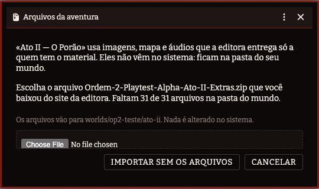

# Ordem Paranormal 2 — Playtest (Não-Oficial)

Sistema para **Foundry VTT** do playtest alpha de *Ordem Paranormal RPG 2*.

> Projeto não-oficial, feito por fã. Sem afiliação, patrocínio ou endosso dos detentores
> de direitos de Ordem Paranormal RPG. Não distribui textos, artes nem conteúdo protegido
> do jogo — só a camada mecânica e a interface.


## O que ele faz

**Dados em escada, não modificadores.** Atributos e perícias são *tamanho de dado*
(d4→d12). Tudo que os modifica sobe ou desce um degrau — nada de `+2`.

**A ficha é a do livro.** Cada perícia mostra o par que será rolado, com os ícones
geométricos que o playtest usa: triângulo d4, quadrado d6, losango d8, pipa d10,
octógono d12. Clique na perícia para rolar; Shift abre o diálogo. Clique no dado para
trocá-lo, ou role a roda do mouse sobre ele. PV, PD e a barra de Ímpeto são trilhas
clicáveis.

**O motor entende as regras sutis:**

- **RA e RB** — o maior e o menor *valor* rolado, não o dado maior. Sempre no card,
  porque arrombar, alcançar e combate leem esses números direto.
- **Crítico** — dois ou mais dados iguais com valor ≥ 6. Ignora a DT.
- **Falha crítica** — todos os dados em 1. Ignora a DT, e oferece a tabela de 1d8 ao
  mestre. Nada é aplicado sem clique dele.
- **Até 4 dados rolados, 3 somados** — com diálogo de escolha, porque a soma máxima
  nem sempre é a melhor jogada.
- **Trocar o atributo pareado** antes de rolar: o atributo-base é sugestão, não trava.
- **Reduções temporárias** de atributo, com botão de *Encerrar cena* que as zera.

**Aptidão é coleção aberta.** Os seis campos padrão vêm prontos, e você adiciona
quantos quiser.

## Investigação

O coração do playtest (spec §6). O mestre monta a cena num painel; os jogadores agem
pela própria ficha.


**Não existe uma ação "Investigar".** Investigar um ponto é **Examinar** ou
**Interagir** — as duas sub-ações em que a ação se resolve. Examinar faz os dois passos
da regra com a mesma perícia:

1. **sem rolar**, entrega tudo com DT ≤ ao tamanho do seu dado;
2. **rolando**, tenta o que ficou acima disso.

Só custa 1 PD quando os dois vêm vazios — e aí o card diz por quê (a perícia não serve
ali, o dado é pequeno, ou já se descobriu tudo).


Cada linha do quadro de informações tem **três estados**, num clique só do mestre:

| Ícone | Estado | O que significa |
|---|---|---|
| 👁️‍🗨️ | Rascunho | O jogador não vê, e Examinar nunca encontra |
| 🔍 | Descobrível | Só quem examinar com a perícia e alcançar a DT |
| 👁️ | Aberta | Todo jogador vê, sem gastar ação |

O painel mostra ao mestre quem descobriu cada linha e um botão para **desfazer** a
descoberta, sem precisar encerrar a cena.


**Sobrecarga mental** (spec §7.6): ao fim de cada rodada, a tabela da cena cobra PD de
todo mundo. A progressão de referência do playtest vem pronta e é editável por
investigação; quando o dano é rolado, cada jogador rola o seu.

## Ações

Tudo que um personagem faz sai da ficha dele, pelo botão **Ações** — nunca do painel do
mestre. Um jogador com dois personagens sempre sabe qual dos dois está agindo.


Ações livres (Recapitular, Compartilhar, Ajudar, Usar habilidade ou item, Alcançar,
Sustentar, Atacar), os pontos de interesse com Examinar/Interagir e as ferramentas que
aquele personagem carrega, e os desafios com as abordagens que o mestre habilitou.

Quando uma ação precisa de perícia, a escolha usa a mesma lista da ficha:


## Desafios

Um obstáculo entre o grupo e a pista. O mestre liga só as abordagens que fazem sentido
naquele objeto — uma porta emperrada não se hackeia, um painel eletrônico não se arromba
no braço.


- **Arrombar** (§7.2) — 1 PV por tentativa, acumula RA até a pontuação alvo.
- **Destrancar** (§7.1) — minigame de Mastermind, com histórico de palpites.
- **Hackear** (§7.3) — técnico (com cronômetro de 10s) e social (banco de perguntas do
  mestre), cada um com o próprio gate de rodada.
- **Genérico** — qualquer outra situação: o mestre diz a perícia e o rótulo.

## Combate e ferimentos

Versão simplificada e explicitamente temporária do playtest (§8), isolada para ser
trocada inteira quando sair a definitiva.


Teste oposto de Luta; quem vence causa RA com arma ou RB desarmado. O defensor escolhe
entre revidar e **esquivar** — Acrobacia com um d6 somado, a única exceção aditiva do
playtest: vencendo, ninguém sofre nem causa dano.

Zerar PV pede teste de **Vigor**; zerar PD pede **Disciplina**. A DT escala 7 → 10 → 13
→ 16 por teste já feito, e a consequência da falha no trauma é configurável, porque o
próprio texto avisa que vai mudar.

## Compêndios do Ato I

O sistema traz o Ato I inteiro: os cinco pré-gerados, os handouts, os tokens, o mapa do
porão e as duas faixas da trilha. **As artes viajam junto**, em `assets/ato-i/` — o
material do Ato I é liberado para uso, então não há passo de instalação: importou,
funcionou.

O pacote da editora tem nomes com acento e três versões do mesmo mapa; o que entra no
sistema é a versão em slug e só o que algum compêndio referencia. Quando a editora
atualizar o pacote, `npm run ato-i:assets` refaz a cópia.

Os compêndios ficam em pastas, não soltos na lista:

```
Ordem Paranormal 2
├── Regras
│   ├── Habilidades          Foco Mental, Ímpeto, Avaliação, Mentoria, Prontidão…
│   ├── Ocupações            Cientista, Operário, Artista, Professor…
│   └── Ferramentas          as 10 da Ordo Realitas, com as cargas da regra
├── Ato I — A Maldição do Ídolo de Pedra
│   ├── A Aventura           importa tudo abaixo de uma vez, já vinculado
│   ├── Pré-gerados          os cinco, com habilidades e tokens
│   ├── Cenas                o Porão, com muros e portas secretas
│   ├── Handouts             os 18 handouts e os 5 históricos
│   └── Trilha               as duas faixas
└── Ato II — A Maldição do Ídolo de Pedra
    └── A Aventura           os agentes voltam ao porão; as artes vêm do zip da editora
```

**Comece pela Aventura.** Importar esse único documento traz a cena, a trilha, os
pré-gerados, os handouts, os pontos de interesse do porão com o quadro de informações
preenchido, os desafios e uma investigação com tudo já vinculado — mesa montada.

### A aventura sai do seu PDF

O texto do Ato I é da editora, então **não vem no repositório nem no pacote do sistema**
— mesma política do PDF e das artes. Quem tem o playtest gera na própria máquina:

```bash
# com o PDF em docs/Ordem-Paranormal-RPG-2-Playtest-Alpha-agentes.pdf
npm run ato-i:extrair          # lê os pontos de interesse do PDF
npm run ato-i:gerar-aventura   # monta a aventura com cena, trilha, handouts e tudo
npm run pack:build
```

`extrair-aventura.py` lê o capítulo inteiro do PDF, não só as tabelas: 31 pontos de
interesse com 86 linhas de quadro (perícias já nas chaves do sistema — `Aptidão
(Humanas)` → `aptidao.humanas`), a descrição do que se vê e o texto de mestre que o livro
põe depois de cada quadro, as caixas "CONTEÚDO" do que se revela ao vencer um desafio,
os vinte livros das cinco prateleiras, a Mesa de Poker impressa na coluna da direita da
Sala Secreta. O extrator é conferido contra o livro: cada célula de DT vira uma linha, e
cada linha tem que ser idêntica à coluna *Informação* do PDF — 86 de 86.

As condições do livro — *apenas Victor*, *se o ídolo for quebrado* — abrem o texto da
linha e a deixam como **rascunho**: Examinar não alcança, o mestre libera quando a
condição acontece. *Medicina ou Sobrevivência* não é condição, é perícia alternativa, e
a linha segue descobrível.

As caixas laterais e o texto de mestre viram os **dez desafios de acesso** com os números
do livro: `ARROMBAR (DT 10, PA 10)`, `DESTRANCAR (senha: 3d6, 3 tentativas)`, a tabela
de faixas do Hack Técnico (uma conta por faixa no painel; segundos por faixa no
computador), as seis perguntas do Hack Social do celular, a estante como obstáculo de
Sustentar. A senha **não** vem sorteada — quem sorteia é o mestre, na ficha, senão ela
viajaria à vista de todos. Os handouts citados (*"Mostre o HANDOUT 06"*) viram a imagem
na descrição de mestre do ponto.

E o que não é ponto nem desafio também entra: a faca de churrasco e os dois molhos de
chaves como itens; o roteiro do ato (introdução, cena inicial com a legenda do mapa,
narração final) e *A Maldição do Ídolo de Pedra* como diários de mestre; e a tabela da
maldição como **roteiro por rodada** da investigação — `Nova rodada` põe a narração no
card e o efeito só para o mestre, e o painel mostra o que vem a seguir.

Sem o PDF, o compêndio da aventura simplesmente não existe, e os demais funcionam
normalmente.

**Os três mapas viram uma cena.** Os arquivos publicados são o mesmo desenho revelado em
etapas — porão, porão + sala secreta, e completo com o duto. Trocar de mapa no meio da
sessão perde tokens, luzes e névoa explorada, então a cena usa o mapa completo e esconde
o resto com **portas secretas**: invisíveis para o jogador, abertas pelo mestre quando o
grupo descobre a passagem.

A cena vem murada — perímetro, divisórias internas e as passagens secretas. Para partir
do zero em outro mapa, `npm run ato-i:gerar-cena` deriva um primeiro traçado comparando
os três arquivos publicados: sai o perímetro e a fronteira entre as áreas, o suficiente
para depois ajustar à mão.

Fez esses muros, pôs luzes, ajustou a cena? Traga de volta para o compêndio:

```bash
npm run ato-i:cena -- --mundo op2-meu --cena "O Porão"   # feche o Foundry antes
npm run ato-i:cena -- --de ~/Downloads/fvtt-Scene-porao.json   # ou o export da interface
npm run pack:build
```

Paredes, luzes, sons, ladrilhos e desenhos entram. Tokens, notas e a névoa já explorada
ficam de fora: apontam para documentos e estado do seu mundo, e não significariam nada
em outro.

Ocupação é texto livre na ficha e concede uma habilidade (spec §2.1). O Item de
ocupação guarda as duas coisas juntas: **arraste a ocupação para a ficha** e ela
preenche o campo e traz a habilidade dela, já marcada como de ocupação.

## Compêndios do Ato II

O Ato II é o porão revisitado pelos agentes da Ordem, com as dez ferramentas da Ordo
Realitas. Ele **não é público**: o texto está no mesmo PDF, e as artes num zip que a
editora entrega a quem assina os Arquivos Secretos. O sistema não distribui nada disso —
distribui o que faz com isso.

**Um único documento `Adventure`** traz a cena (o porão redesenhado, com as 39 paredes
do Ato I transportadas para o mapa novo), os cinco agentes transcritos das fichas
(Amanda, Antônio, Heitor, Raven e Val, nível 6, com as oito habilidades novas no
compêndio), os handouts e o Compêndio da Ordem em PDF, os três áudios do Medidor EMF
como playlist, as dez ferramentas prontas para arrastar, os **25 pontos de interesse**
com as **63 linhas de quadro** e o **setor de ferramentas** de cada um (44 leituras,
conferidas contra a tabela *Locais de uso de cada ferramenta* do livro), os três
desafios de acesso, o roteiro do ato com as instruções de mestre de cada ferramenta,
as regras da maldição para o caso de quebrarem o Ídolo, e a investigação com tudo
vinculado.

### As artes vêm do seu zip



Ao importar a aventura, o sistema pede o `Ordem-2-Playtest-Alpha-Ato-II-Extras.zip` —
o mesmo arquivo baixado do site da editora, sem extrair. Ele é descompactado no
navegador e os 31 arquivos que a aventura usa (tokens, retratos, fichas, históricos,
handouts, mapa, áudios, o PDF do Compêndio) vão para a pasta **do seu mundo**
(`worlds/<mundo>/ato-ii/`). Nada é instalado no sistema, e uma atualização do sistema
não apaga nada. Importou num segundo mundo? Ele pede o zip de novo. Perdeu os arquivos
ou importou sem eles? *Configurações → Arquivos das aventuras* reenvia.

O casamento com o zip é pelo nome do arquivo, sem acento: tanto faz como o seu
descompactador grava os nomes.

### O que o livro imprime errado, e como entra

A diagramação do Ato II repete blocos de outros pontos. Nada é apagado: a descrição do
Símbolo no Teto impressa no Depósito A, no Molho de Chaves e no Duto (que ainda leva
o título "Símbolo no Teto") recebe a descrição do mesmo objeto no Ato I, com a nota do
que o livro imprime; as linhas do quadro do Molho de Chaves repetidas no Depósito B e
no Armário de Roupas, e a da cadeira da Mesa de Poker repetida na Churrasqueira, entram
como **rascunho** com a nota de onde são. Os quatro rótulos "Laboratório" do Freezer
viram Laboratório, Lanterna UV, EMF e Termômetro pelo que a leitura diz — e a tabela do
livro confirma. Tudo está em [docs/LACUNAS.md](docs/LACUNAS.md).

### O Rádio Modificado, como no livro

O livro entrega blocos de palavras (*PENSE NA*, *SUA FILHA,*, *ELOÍSA*…), alguns falsos,
e o jogador monta a frase. O app faz isso: um monte só com todas as peças que o teste
de Tecnologia não removeu, sem marcar as falsas — ordenar e descartar é o jogo. Na ficha
do ponto, as peças de um conjunto são escritas separadas por `|`.

### Gerar

```bash
npm run ato-ii:extrair          # lê as p. 72–103 do PDF e se confere contra o livro
npm run ato-ii:gerar-cena       # transporta as paredes do Ato I para o mapa novo
npm run ato-ii:gerar-aventura   # monta o Adventure
npm run pack:build
```

O extrator sai com erro se qualquer célula de DT não virar linha, se algum ponto reagir
a uma ferramenta diferente do que a tabela do livro diz, ou se a solução de um rádio não
casar com as peças. O passo a passo está em [scripts/ato-ii/README.md](scripts/ato-ii/README.md).

## Em português

O sistema é escrito em pt-BR primeiro, e um jogador que ainda não escolheu idioma entra
em português automaticamente — mesmo que o servidor esteja configurado em inglês. Quem já
escolheu um idioma mantém o seu, e o mestre desliga esse comportamento em
**Configurações → Padronizar o idioma em português**.

Isso traduz o sistema. A interface do **próprio Foundry** continua em inglês até você
instalar a tradução da comunidade — o manifesto já a recomenda:

```
https://github.com/mclemente/fvtt-ptbr-core-translation/releases/latest/download/module.json
```

## Compatível com v13 e v14

A maior quebra entre as versões é o formato dos Active Effects. Este sistema não usa
Active Effects: a escada de dados não é representável pelo modo aditivo do core, então
os passos são resolvidos em `prepareDerivedData()`. Isso deixa o mesmo código rodando
nas duas versões sem camada de adaptação.

## Instalação

Cole o manifesto no instalador de sistemas do Foundry:

```
https://github.com/SergioSJS/ordem-paranormal-2e-fvtt/releases/latest/download/system.json
```

## Desenvolvimento

```bash
npm install
npm run setup        # symlink para a pasta de sistemas do Foundry
npm run watch:css    # sass em watch
npm run check        # lint + testes + build do CSS
npm run pack:build   # compila os compêndios de packs/sources/
npm run e2e          # roda o sistema num Foundry de verdade
```

Se os compêndios aparecerem soltos na barra lateral, em vez de dentro de
`Ordem Paranormal 2 → Regras / Ato I`, é o mundo que perdeu as pastas: elas são
documentos `Folder` do próprio mundo, e o Foundry só as materializa a partir do
manifesto quando a lista de packs muda. Com o Foundry **fechado**:

```bash
npm run reparar-pastas -- <mundo>
```

`npm run check` roda o lint, os testes offline (`node --test`, sem runner externo) e o
build do CSS. `npm run e2e` sobe o sistema num Foundry descartável e confere o que os
testes offline não alcançam — sanitização dos cards de chat, contexto real das fichas,
hooks depreciados, CSS aplicado, texto cortado. O passo a passo está em
[scripts/e2e/README.md](scripts/e2e/README.md).

Os prints deste README são gerados por `node scripts/e2e/capturar.mjs`, contra o mesmo
Foundry descartável — nenhuma tela aqui é mockup.

Detalhes do loop local, teste em duas versões do Foundry e convenções: [CLAUDE.md](CLAUDE.md).

## Estado

Em desenvolvimento, versão 0.0.1.

| Fase | O que entrou | Situação |
|---|---|---|
| 1 | Ficha, motor de dados, escada, crítico/falha crítica | pronta |
| 2 | Investigação: POIs, Examinar/Interagir, Recapitular, Compartilhar, rodadas, sobrecarga | pronta |
| 3 | Desafios (Arrombar, Destrancar, Hackear, genérico), Alcançar, Sustentar, ferramentas da Ordo Realitas | pronta |
| 4 | Testes opostos, Ajuda, usar habilidades e itens, combate simplificado, ferimentos e traumas | pronta |
| Compêndios | Ato I inteiro dentro do sistema; Ato II inteiro a partir do PDF e do zip da editora | prontos |

O playtest é explicitamente parcial: NEX, progressão por nível e traumas permanentes
ainda não foram publicados. Onde o texto é ambíguo ou se contradiz, o sistema expõe um
**setting** com o default recomendado — a lista está em [docs/LACUNAS.md](docs/LACUNAS.md).

O roadmap completo está em [docs/ROADMAP.md](docs/ROADMAP.md).

## Licença

Código sob [GPL-3.0](LICENSE) — Copyright (C) 2026 Sérgio Sousa. Fontes sob OFL 1.1 — veja
[assets/fonts/LICENSES.md](assets/fonts/LICENSES.md).
